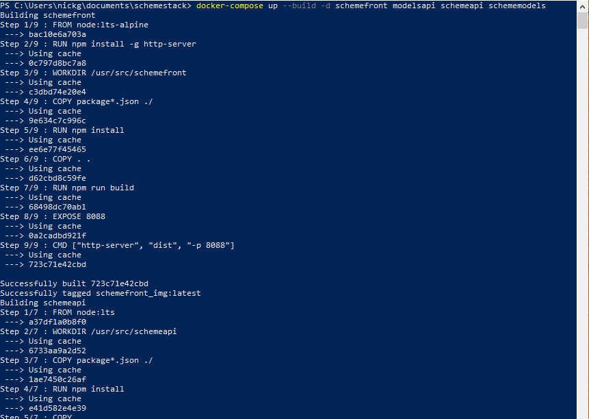

# Scheme
## A Query Builder Utilizing Presto SQL Engine

Hi! Welcome to Scheme!

This project intends to be a fast, no hassle, easy to set up and pain free query builder, utilizing Presto SQL Engine to run SQL queries.

If you, or, more likely, your company, use a Presto SQL Cluster as your data processing engine, you can connect Scheme painlessly and generate SQL queries effortlessly with the guided query builder. Generate complex queries with multiple where statements, join statments, orders, and limit statements.

How do I run this project? What dependencies do I need?

*Fortunately, all you need is docker desktop or a docker-compose compatible service.*

Wow! This application will run the same on any device that is capable of running docker, hassle free (well..maybe not the same based on the hardware...but still)! I personally hate long and tedious software setup processes, so I tried to make this as hassle free as possible!

Steps to Run:
  - clone this git repository onto your machine
  - open powershell/terminal and go to the directory where you downloaded the repository
  - in the root folder of the project, type: **docker-compose up -d --build schemefront modelsapi schemeapi schememodels**
  - wait while docker compiles the services, downloads dependencies, and initializes containers
  - once ready, in your browser go to either http://yourhost.com:8088 or, on the machine running docker, http://localhost:8088
  - thats it!

This application is currently rolling out new features as it goes, it is currently in its infancy! As well as even more complex queries, I currently have the backend logic in progess to handle user authentication and chart generation. Both of these features will be
available soon, but if you would like to just test out the query builder go ahead!

When accessing the application, you will be directed to the schema instances you currently have, in a list. You will not have any at first, and will be prompted as such! Hit create and fill out the schema instance creation form, using your presto credentials. These include:
  - **host** where the cluster runs
  - **port** to access the cluser
  - the data **catalog** where your schema lives
  - the **schema** you would like to use
  - the **user** for your cluster's server

That's it! You can also create as many of these as you need, depending on the amount of data schemas you may have in Presto, or even in multiple Presto Clusters. Scheme will look at the Presto schema and return the schema definition to you, which includes useful information on the tables and columns, as well as data types, in your schema.

Click on a schema, select use and you will will be directed to the SQL generator, which will guide you through the query generation process, based off of the schema defintion that your schema instance contains. Your query can be as simple or complex as you want, up to you!

Hit query, wait, and get results! Defaults to 3500 returned, but you can go higher at your own risk (you might run out of memory or experience an issue when the datasource is too large)

Error in your query? No worries! Scheme will also return an error message directly from your Presto cluster if you made a mistake (or if Presto made a mistake...it might have).

If you run into bugs, **let me know!** I am currently working to test as many cases as possible, running into issues using your software is a headache nobody enjoys.

**Scheme on I guess?**

## Some Guided Images...

### Application Deployment

### Stack Running in Docker...

### Connect to Presto!

### Generate a Query!

### Get Real Results Based on Your Data

